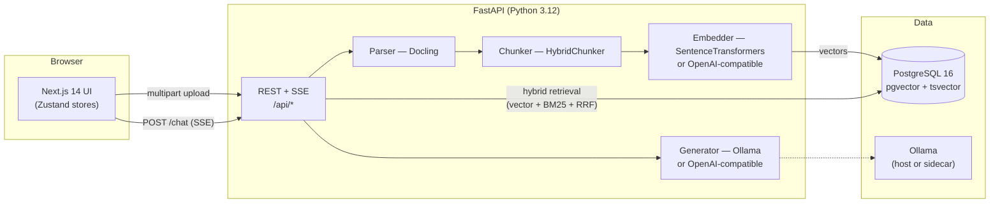

<h1 align="center">
  
</h1>

<p align="center">
  <strong>A self-hosted, production-ready Retrieval-Augmented Generation (RAG) stack.</strong><br/>
  Upload documents — chat with them, with grounded answers, streaming token-by-token, and clickable citations.
</p>

<p align="center">
  <a href="https://github.com/omersx/RagUi/actions/workflows/ci.yml"></a>
  
  
  
  <a href="LICENSE"></a>
</p>

RagUi parses your documents (PDF, DOCX, HTML, PPTX, MD) with [Docling](https://github.com/DS4SD/docling), chunks them contextually, embeds them into PostgreSQL + `pgvector`, and answers questions by fusing keyword and semantic retrieval — streaming grounded answers over Server-Sent Events with source citations. Runs fully local (Ollama / SentenceTransformers) or with any OpenAI-compatible API.

---

## Table of contents

- [Features](#features)
- [Architecture](#architecture)
- [Quick start (development)](#quick-start-development)
- [Production deployment](#production-deployment)
- [Configuration](#configuration)
- [Security](#security)
- [API overview](#api-overview)
- [Testing](#testing)
- [Project layout](#project-layout)
- [Documentation](#documentation)
- [Contributing](#contributing)
- [License](#license)

## Features

**Ingestion**
- 📄 Docling parsing — tables, layout awareness, optional OCR for scanned PDFs
- ✂️ Contextual chunking via Docling's HybridChunker (heading hierarchy + page ranges preserved)
- 🔒 SHA-256 deduplication — re-uploads return HTTP 409

**Retrieval & generation**
- 🔀 Dynamic model switching — local or API models for embedding *and* generation, independently, no restarts
- 🌐 Any OpenAI-compatible provider per slot — OpenRouter, Groq, DeepSeek, Mistral, Together, LM Studio, …
- 🧠 Per-model vector tables — auto-created, dimension-probed, injection-safe naming
- 🔎 Hybrid search — Postgres `tsvector` (BM25-style) + pgvector cosine similarity fused with Reciprocal Rank Fusion; weights tunable live
- ⚡ Streaming chat — SSE with sources delivered before tokens, session auto-titling

**Application**
- 📚 Knowledge dashboard — file/chunk/storage stats, per-model usage, cascading deletes
- 🕘 Persistent history — sessions grouped by date, resume any conversation
- ⚙️ Settings UI — provider pickers, key tester, retrieval tuning, live service status
- 📱 Responsive UI — desktop icon rail collapses to a mobile bottom tab bar
- 🛡️ Production hardening — optional bearer-token auth, rate limiting, non-root containers, security headers

## Architecture



**Ingestion:** upload → Docling parse → contextual chunk → embed → store in a per-model vector table (HNSW + GIN indexed).

**Chat:** question → retrieve top-k chunks (semantic / fulltext / hybrid-RRF) → augmented prompt → streamed tokens → persist messages + auto-title.

## Quick start (development)

Prerequisites: **Docker Desktop**, **Node 20+**, **Python 3.12**.

```bash
npm run setup   # creates the venv, installs backend (CPU torch) + frontend deps, copies .env files
npm run dev     # starts db + backend + frontend with prefixed logs
```

Open **http://localhost:3000** — the Next dev server proxies `/api/*` to the backend, so there's no CORS setup.

| Log prefix | Service | URL |
|---|---|---|
| `[db]` | pgvector Postgres container | localhost:5432 |
| `[backend]` | uvicorn (hot reload) | http://localhost:8000 |
| `[web]` | Next.js dev server | http://localhost:3000 |

Prefer separate terminals?

```bash
docker compose up -d db          # terminal 1 — database
cd backend && ./run-dev.sh       # terminal 2 — backend (run-dev.ps1 on Windows)
cd frontend && npm run dev       # terminal 3 — frontend
```

### Local AI (optional)

Install [Ollama](https://ollama.com) and pull at least one chat model:

```bash
ollama pull llama3.2
```

Without Ollama everything still works using OpenAI-API models — the UI simply shows it as offline.

<details>
<summary>Troubleshooting: Docker Hub image pulls blocked (CDN 403)</summary>

```bash
docker pull mirror.gcr.io/pgvector/pgvector:pg16
docker tag mirror.gcr.io/pgvector/pgvector:pg16 pgvector/pgvector:pg16
```
</details>

## Production deployment

The full stack ships as three containers (plus an optional nginx reverse proxy profile):

```bash
cp .env.example .env         # configure — see the table below
nano .env

# Without proxy (backend/frontend bound to 127.0.0.1 by default):
docker compose -f docker-compose.prod.yml --env-file .env up -d --build

# With nginx reverse proxy (SSE-safe config included):
docker compose -f docker-compose.prod.yml --env-file .env --profile with-proxy up -d --build

docker compose -f docker-compose.prod.yml logs -f
docker compose -f docker-compose.prod.yml down
```

Build notes:
- Backend image installs **CPU-only PyTorch** (~4 GB smaller than the default).
- A `model_cache` volume persists downloaded SentenceTransformers models across restarts.
- Both images run as **non-root users**; the frontend uses Next.js **standalone output**.
- `NEXT_PUBLIC_API_URL` is baked at build time and passed as a build arg by compose.
- Chat responses set `X-Accel-Buffering: no` so SSE streams unbuffered through nginx.

### Backups

```bash
docker exec ragui_db pg_dump -U ragui ragui > backup_$(date +%F).sql
```

## Configuration

All configuration is environment-driven — copy `.env.example` to `.env` (root, used by compose) and adjust:

| Variable | Default | Purpose |
|---|---|---|
| `DB_PASSWORD` | `ragui_dev` (dev) | Postgres password — **required** in production |
| `PUBLIC_API_URL` | `http://localhost:8000` | Browser-facing backend URL (baked into the frontend build) |
| `OLLAMA_BASE_URL` | `http://host.docker.internal:11434` | Where the backend finds Ollama |
| `MAX_UPLOAD_SIZE_MB` | `50` | Upload size cap (nginx's limit is set above this) |
| `ALLOWED_ORIGINS` | `http://localhost:3000` | CORS allowlist |
| `API_AUTH_TOKEN` | *(empty)* | Shared bearer token protecting every route except `/api/health`. Empty = auth off |
| `RATE_LIMIT_PER_MINUTE` | `120` | Per-IP cap on mutating `/api` requests (`0` disables) |
| `BACKEND_BIND` | `127.0.0.1` | Host interface for port 8000 |
| `FRONTEND_BIND` | `127.0.0.1` | Host interface for port 3000 |
| `WEB_CONCURRENCY` | `1` | uvicorn workers (each keeps its own model copies in RAM) |

## Security

Designed for self-hosting; harden before exposing beyond localhost:

1. **Set `API_AUTH_TOKEN`** — every route except the health check then requires `Authorization: Bearer <token>`:
   ```bash
   python -c "import secrets; print(secrets.token_urlsafe(32))"
   ```
   Paste the token once in the app under **Settings → Connection → Access token**; the frontend sends it automatically.
2. **Keep the default loopback binds**, or use the nginx profile — nothing else faces the network unless you opt out via `*_BIND`.
3. **Terminate TLS** at your own reverse proxy / load balancer (the bundled nginx serves HTTP only).
4. **Rate limiting is on by default**; scale horizontally? Move limiting to the edge.

Provider API keys are stored only in the user's browser (localStorage) and sent per request — never persisted server-side. See [SECURITY.md](SECURITY.md) for the full model and responsible-disclosure instructions.

## API overview

Base path: `/api` · Interactive docs at `http://localhost:8000/docs` (disabled when an auth token is configured).

| Method | Route | Purpose |
|---|---|---|
| GET | `/health` | DB ping + Ollama probe + loaded models |
| POST | `/ingest` | Multipart upload → parse → chunk → embed → store (409 on duplicates) |
| POST | `/chat` | SSE stream: `session` → `sources` → `token…` → `title` → `done` |
| POST | `/test-key` | Validate an OpenAI-compatible API key |
| GET | `/knowledge/stats` | Aggregate stats across all model tables |
| GET | `/knowledge/files` | List indexed files |
| DELETE | `/knowledge/files/{id}` | Delete file + cascade chunks |
| GET | `/sessions` | List chat sessions |
| GET | `/sessions/{id}/messages` | Messages of a session |
| DELETE | `/sessions/{id}` | Delete a session |

## Testing

```bash
npm run test:backend   # pytest — wiring, schema guards, registry sanitization
npm run typecheck      # frontend TypeScript (strict)
cd frontend && npm run build   # production build must compile
```

CI runs the same checks on every push/PR (GitHub Actions).

## Project layout

```
├── backend/
│   ├── app/
│   │   ├── main.py           # FastAPI factory, CORS, auth wiring, lifespan
│   │   ├── config.py         # env-driven settings (pydantic-settings)
│   │   ├── database.py       # asyncpg pool, DDL, dynamic chunk tables
│   │   ├── models/schemas.py # pydantic request/response models
│   │   ├── routers/          # health, ingest, chat (SSE), knowledge, sessions
│   │   ├── services/         # parser, chunker, embedder, retriever, generator, file_manager
│   │   └── utils/            # structlog setup, auth, rate limiting, model registry
│   └── tests/
├── frontend/
│   └── src/
│       ├── app/              # App Router shell
│       ├── components/       # sidebar, chat, upload, knowledge, history, settings, ui
│       ├── lib/              # typed API client incl. SSE reader + XHR progress
│       ├── stores/           # zustand: config (persisted), chat, view, toast
│       └── types/
├── nginx/nginx.conf          # SSE-safe reverse proxy (with-proxy profile)
├── scripts/                  # setup + dev orchestration
└── docs/                     # specification & implementation plan
```

## Documentation

- [Specification](docs/SPECIFICATION.md) — full functional/technical spec
- [Implementation plan](docs/IMPLEMENTATION_PLAN.md) — phased build plan with acceptance criteria

## Contributing

PRs are welcome! See [CONTRIBUTING.md](CONTRIBUTING.md) for setup, workflow, and guidelines. Please report vulnerabilities privately per [SECURITY.md](SECURITY.md).

## License

[MIT](LICENSE) © RagUi contributors
